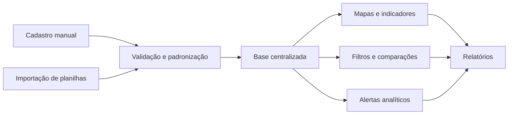

# SENTINELA

### Sistema Estratégico de Análise Territorial de Incidências, Níveis, Estatísticas, Localizações e Alertas

O **SENTINELA** é uma plataforma web e mobile para centralização, cadastro, visualização e análise de ocorrências criminais.

Sua proposta é transformar registros dispersos em informações organizadas, comparáveis e úteis para a compreensão estratégica da criminalidade.

---

## Visão geral

Dados de ocorrências podem estar distribuídos em planilhas, arquivos e sistemas diferentes, dificultando a construção de uma visão consolidada sobre determinada região.

O SENTINELA reunirá essas informações em um único ambiente, permitindo localizar áreas com maior incidência, compreender variações ao longo do tempo, identificar padrões geográficos e temporais e gerar relatórios de apoio à análise.

| Item | Definição |
|---|---|
| **Tipo de solução** | Sistema de informação web e mobile |
| **Finalidade** | Análise e monitoramento estatístico de ocorrências criminais |
| **Entrada de dados** | Cadastro manual e importação de planilhas |
| **Principais resultados** | Mapas, indicadores, comparações, alertas e relatórios |
| **Acesso** | Restrito a usuários institucionais autorizados |
| **Situação atual** | Planejamento e definição do produto |

---

## Objetivo

Desenvolver uma solução capaz de receber dados de ocorrências por cadastro individual ou importação em lote e transformá-los em informações visuais e analíticas.

O sistema deverá permitir que usuários autorizados compreendam:

- onde as ocorrências estão concentradas;
- quais categorias aparecem com maior frequência;
- em quais dias e horários há maior incidência;
- como os dados variam entre regiões e períodos;
- quais alterações estão fora do comportamento histórico esperado.

---

## Como o SENTINELA funcionará

O fluxo geral do sistema será composto pelas seguintes etapas:

1. Os dados serão inseridos manualmente ou importados por meio de arquivos padronizados.
2. O sistema verificará campos obrigatórios, formatos, coordenadas e possíveis duplicidades.
3. Os registros validados serão centralizados em uma única base.
4. As informações serão apresentadas em mapas, dashboards, gráficos e comparações.
5. Alterações relevantes poderão gerar alertas analíticos.
6. Os resultados poderão ser consolidados em relatórios.

---

## Estrutura da solução

O SENTINELA será composto por uma **plataforma web**, um **aplicativo mobile** e um ambiente compartilhado de dados.

| Plataforma web | Aplicativo mobile |
|---|---|
| Análises completas e filtros avançados | Consulta rápida de indicadores |
| Importação de planilhas | Cadastro manual adaptado ao celular |
| Cadastro e validação de ocorrências | Mapa simplificado |
| Mapas com diferentes formas de visualização | Filtros essenciais |
| Comparações detalhadas | Alertas analíticos |
| Geração de relatórios | Consulta de relatórios |
| Administração e auditoria | Consulta dos próprios registros |

As duas plataformas utilizarão os mesmos dados, permissões e regras de validação, garantindo consistência entre os registros cadastrados no computador e no celular.

---

## Funcionalidades principais

### 1. Cadastro e centralização de ocorrências

O sistema permitirá registrar uma ocorrência individualmente ou importar diversos registros de uma só vez.

O cadastro deverá contemplar informações como:

- tipo de crime;
- data e horário;
- localização;
- região;
- fonte do registro;
- método de entrada;
- situação de validação.

Cada inclusão ou alteração ficará associada ao usuário responsável, permitindo rastrear o histórico dos registros.

---

### 2. Importação de planilhas

Arquivos CSV ou planilhas padronizadas poderão ser utilizados para popular a base de dados.

Antes da gravação definitiva, o SENTINELA verificará:

- presença das colunas obrigatórias;
- formatos de datas e horários;
- categorias não reconhecidas;
- coordenadas inválidas;
- registros possivelmente duplicados;
- inconsistências entre região e localização.

Ao final da importação, o usuário receberá um resumo com os registros:

- aceitos;
- rejeitados;
- duplicados;
- pendentes de correção.

---

### 3. Dashboard de indicadores

O painel principal apresentará uma visão resumida do período selecionado.

| Indicador | Informação apresentada |
|---|---|
| **Total de ocorrências** | Quantidade registrada no período |
| **Crimes predominantes** | Categorias com maior número de registros |
| **Regiões em destaque** | Áreas com maior incidência |
| **Variação temporal** | Crescimento ou redução em relação ao período anterior |
| **Distribuição por horário** | Faixas de maior concentração |
| **Alertas recentes** | Alterações relevantes identificadas nos dados |

O dashboard permitirá que o usuário compreenda rapidamente o cenário geral antes de acessar análises mais detalhadas.

---

### 4. Mapa criminal interativo

As ocorrências poderão ser visualizadas geograficamente por meio de:

- pontos individuais;
- agrupamentos por proximidade;
- mapa de calor;
- limites de regiões;
- indicadores vinculados à área selecionada;
- comparação da concentração criminal em diferentes períodos.

O usuário poderá selecionar uma área, consultar seus indicadores e alterar os filtros sem sair do mapa.

---

### 5. Filtros e comparações

O SENTINELA permitirá combinar diferentes filtros para construir análises específicas.

| Categoria | Exemplos |
|---|---|
| **Temporal** | Ano, mês, intervalo personalizado, dia da semana e horário |
| **Geográfica** | Região, localidade ou área selecionada no mapa |
| **Criminal** | Tipo, categoria e gravidade |
| **Contextual** | Ambiente da ocorrência, fonte e método de entrada |

Também será possível comparar:

- duas ou mais regiões;
- mês atual e mês anterior;
- períodos equivalentes de anos diferentes;
- intervalos personalizados;
- evolução histórica de uma categoria criminal.

---

### 6. Alertas analíticos

O sistema poderá sinalizar situações como:

- quantidade acima da média histórica;
- crescimento contínuo em determinado período;
- redução significativa de uma categoria;
- surgimento de uma nova concentração geográfica;
- mudança no dia de maior incidência;
- mudança no horário de maior incidência.

Os alertas terão caráter estatístico e informativo.

Cada alerta deverá apresentar:

- região analisada;
- período considerado;
- categoria da ocorrência;
- referência utilizada na comparação;
- data de geração;
- situação do alerta.

O sistema não afirmará que um crime necessariamente ocorrerá.

---

### 7. Relatórios

Os usuários autorizados poderão gerar relatórios:

- diários;
- semanais;
- mensais;
- personalizados.

Os documentos poderão incluir:

- resumo executivo;
- indicadores consolidados;
- mapas;
- gráficos;
- tabelas;
- comparação entre regiões e períodos;
- categorias mais frequentes;
- dias e horários críticos;
- fonte dos dados;
- período de atualização.

---

### 8. Segurança e auditoria

Toda ação relevante realizada no sistema deverá ser rastreável.

O SENTINELA manterá registros de:

- usuário responsável;
- data e horário;
- cadastro realizado;
- alteração efetuada;
- validação de ocorrência;
- importação de arquivos;
- consulta de dados;
- geração de relatórios;
- resultado da operação.

Essa trilha de auditoria permitirá verificar quem realizou cada ação e quando ela ocorreu.

---

## Perfis de acesso

Cada usuário terá acesso somente às funções compatíveis com sua responsabilidade.

| Perfil | Atribuições principais |
|---|---|
| **Administrador** | Configurações, usuários, permissões e parâmetros |
| **Gestor** | Dashboards, mapas, comparações, alertas e relatórios |
| **Analista** | Filtros avançados e análises temporais e geográficas |
| **Supervisor** | Consulta gerencial de indicadores e relatórios |
| **Cadastrador** | Cadastro e atualização autorizada de ocorrências |
| **Auditor** | Verificação de acessos, importações e alterações |

---

## Escopo da primeira versão

A primeira versão do SENTINELA deverá contemplar:

- [ ] autenticação e controle de acesso;
- [ ] cadastro manual de ocorrências;
- [ ] importação e validação de planilhas;
- [ ] identificação de possíveis duplicidades;
- [ ] dashboard com indicadores consolidados;
- [ ] mapa criminal interativo;
- [ ] filtros geográficos, temporais e criminais;
- [ ] comparação entre regiões e períodos;
- [ ] alertas baseados em alterações estatísticas;
- [ ] geração de relatórios;
- [ ] trilha de auditoria;
- [ ] aplicativo mobile com as funções essenciais.

---

## Limites da primeira versão

O SENTINELA será inicialmente uma plataforma de cadastro e análise.

Não fará parte desta versão:

- despacho ou atendimento emergencial;
- acompanhamento de ocorrências em andamento;
- localização de agentes, equipes ou veículos;
- definição de rotas e patrulhamento;
- comunicação operacional em tempo real;
- envio de ordens operacionais;
- acompanhamento de operações em campo;
- classificação automática de pessoas como suspeitas;
- previsão determinística de crimes.

---

## Princípios do projeto

| Princípio | Aplicação |
|---|---|
| **Orientação por dados** | Informações objetivas, comparáveis e rastreáveis |
| **Segurança** | Controle de acesso e proteção das informações |
| **Privacidade** | Uso somente dos dados necessários |
| **Transparência analítica** | Alertas acompanhados de período, região e referência |
| **Usabilidade** | Interfaces claras para computador e celular |
| **Rastreabilidade** | Histórico de cadastros, alterações e importações |
| **Evolução gradual** | Entrega das funções essenciais antes de recursos avançados |

---

## Status do projeto

O SENTINELA encontra-se na etapa de **definição do produto e planejamento da primeira versão**.

### Próximas etapas

1. detalhamento dos requisitos;
2. prototipação das telas;
3. modelagem dos dados;
4. implementação dos módulos principais;
5. validação do MVP;
6. apresentação do sistema.

---

## Sobre este repositório

Este repositório será utilizado para registrar o desenvolvimento acadêmico do SENTINELA, incluindo:

- documentação do projeto;
- código-fonte;
- protótipos;
- modelos de dados;
- evolução das funcionalidades;
- registros das etapas de desenvolvimento.

> O valor do SENTINELA está em transformar registros dispersos em informação organizada, visual e comparável para apoiar análises mais claras e fundamentadas.
