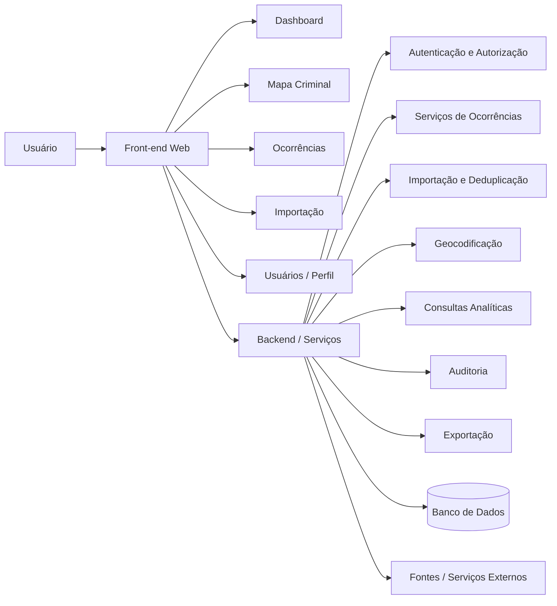

## Arquitetura da informação

O SENTINELA é uma plataforma web orientada ao Distrito Federal, com análise territorial principal por **Região Administrativa (RA)**. Na versão atual, **bairro/setor não é um campo funcional independente** e, quando aplicável, integra o campo de endereço/local. Enquanto os dados oficiais não estiverem disponíveis, o front-end pode utilizar dados fictícios e mocks; a persistência definitiva, backend e carga real ficam concentrados na Etapa 4.

### Fluxo de navegação

```text
Dashboard
├── Mapa Criminal
│   ├── Filtros
│   ├── Camadas
│   └── Detalhes da RA / Ocorrência
├── Ocorrências
│   ├── Pesquisa
│   ├── Listagem
│   └── Cadastro / Edição
├── Importação
│   ├── Upload
│   ├── Mapeamento
│   ├── Pré-visualização
│   └── Validação / Histórico
├── Perfil / Configurações
└── Usuários (Administrador)
```

### Perfis e acesso

| Recurso | Administrador | Operador | Analista |
|---|---:|---:|---:|
| Dashboard / Mapa | ✓ | ✓ | ✓ |
| Consulta / Pesquisa / Filtros | ✓ | ✓ | ✓ |
| Cadastro de ocorrência | ✓ | ✓ | — |
| Edição | ✓ | Conforme política | — |
| Exclusão / Inativação | ✓ | Conforme política | — |
| Importação | ✓ | Conforme autorização | — |
| Exportação | ✓ | Conforme autorização | Conforme autorização |
| Usuários / Permissões | ✓ | — | — |
| Auditoria / Administração | ✓ | — | — |

As permissões devem ser refletidas na interface e obrigatoriamente validadas no backend. O Analista é restrito à consulta e análise; o Operador possui funções operacionais e de análise; o Administrador possui acesso integral.

---

## Design Arquitetural

A arquitetura permanece **independente de stack**. O modelo lógico é composto por front-end web, serviços/backend, persistência, processamento de dados e geocodificação. O desenvolvimento ocorre em duas fases conceituais: primeiro a experiência web com mocks; depois a integração definitiva com banco, backend e dados reais.



### Dados e processamento

```text
Fonte manual / CSV / XLSX
          ↓
Validação e mapeamento
          ↓
Deduplicação
          ↓
Geocodificação, quando necessária
          ↓
Validação da localização
          ↓
Persistência
          ↓
Dashboard + Mapa + Ocorrências
```

Toda ocorrência consolidada deve possuir **latitude e longitude válidas**. As coordenadas podem vir da fonte, ser obtidas por geocodificação ou ser definidas/ajustadas no mapa. Quando a localização não puder ser determinada com segurança, o registro permanece pendente e não é consolidado como ocorrência válida.

### Atributos de qualidade

| Atributo | Diretriz |
|---|---|
| Desempenho | Consultas comuns em aproximadamente até 3 s no p95 para o volume previsto |
| Segurança | HTTPS/TLS, autenticação e autorização no backend |
| Integridade | Processamento transacional e prevenção de duplicidades |
| Usabilidade | Padrão visual do protótipo e feedback de erro/carregamento/sucesso |
| Responsividade | Desktop e notebook, com adaptação a resoluções menores |
| Observabilidade | Logs e métricas suficientes para diagnóstico |
| Escalabilidade | Crescimento do volume sem duplicação da lógica central |

---

## Testes de integração

Os testes devem validar a integração entre **front-end, backend, banco, processamento de importação, geocodificação e dados reais**, principalmente durante a Etapa 4.

| ID | Integração | Cenário | Resultado esperado |
|---|---|---|---|
| IT-01 | API ↔ Autorização | Analista tenta criar ocorrência | Operação bloqueada |
| IT-02 | API ↔ Banco | Cadastro válido | Registro persistido corretamente |
| IT-03 | API ↔ Banco | Cadastro sem natureza, data, horário, RA ou endereço/local | Validação rejeita a operação |
| IT-04 | API ↔ Geocodificação | Importação sem coordenadas | Coordenadas obtidas ou registro fica pendente |
| IT-05 | Importação ↔ Banco | Falha crítica em lote | Rollback; sem inconsistência parcial |
| IT-06 | Importação ↔ Deduplicação | Ocorrência repetida entre fontes | Inserção redundante impedida |
| IT-07 | Analytics ↔ Mapa/Dashboard | Mesmo conjunto de filtros | Contagens idênticas |
| IT-08 | API ↔ Auditoria | Criação, edição, exclusão ou importação | Trilha de auditoria registrada |

### Automação

```text
Jest / Vitest
Supertest
Testcontainers
Banco com suporte espacial
Playwright
GitHub Actions
```

A homologação deve conferir especialmente **Dashboard × Mapa × Ocorrências, filtros, mapa de calor, geocodificação, permissões e desempenho**.

---

## Protótipo de baixo nível

### Tela principal

```text
┌────────────────────────────────────────────────────────┐
│ SENTINELA                    Busca            Perfil    │
├────────────┬───────────────────────────────────────────┤
│ Dashboard  │ Filtros: Período | RA | Natureza         │
│ Mapa       ├───────────────────────────────────────────┤
│ Ocorrências│                                           │
│ Importação │                  MAPA                     │
│ Usuários   │                                           │
│ Perfil     │       [Camadas] [Calor] [Pontos]         │
│            │                                           │
├────────────┴───────────────────────────────────────────┤
│ KPI Total | Período | RA selecionada | Indicador       │
└────────────────────────────────────────────────────────┘
```

### Inspeção territorial

```text
┌──────────────────────────────┐
│ SOBRADINHO          ← Voltar │
├──────────────────────────────┤
│ Período                      │
│ Total de ocorrências         │
│ Distribuição por natureza    │
│ Evolução temporal            │
│ Comparação com período       │
│ anterior                     │
│                              │
│ [Ver ocorrências] [Exportar] │
└──────────────────────────────┘
```

### Layout

- O **Mapa Criminal** ocupa a maior área visual.
- Filtros permanecem acessíveis e afetam mapa, dashboard e listagem de forma coerente.
- Controles de camadas ficam sobre a área do mapa.
- Detalhes territoriais podem aparecer em painel lateral.
- A interface prioriza desktops e notebooks, com adaptação para resoluções menores.

---

## Storyboard

### Persona
**Analista de Políticas de Segurança**, com acesso exclusivo à consulta e análise.

| Cena | Ação | Feedback |
|---|---|---|
| **1. Contexto** | Abre o Mapa Criminal e seleciona Sobradinho + último trimestre | Mapa e indicadores são atualizados |
| **2. Descoberta** | Aplica filtro de natureza e ativa o mapa de calor | Concentrações são recalculadas conforme os filtros |
| **3. Análise** | Seleciona uma RA/área no mapa | Painel exibe total, distribuição e evolução temporal |
| **4. Desfecho** | Compara períodos ou exporta o resultado | Dados filtrados são apresentados/exportados conforme a permissão |

O fluxo deve manter o mesmo conjunto filtrado de ocorrências entre **Dashboard, Mapa Criminal e Listagem**, evitando divergência de indicadores.
